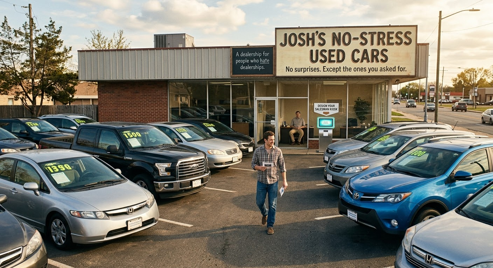

# Josh's No-Stress Used Cars

## Introduction

Every bad car-buying experience is really a consent problem. The pressure, the fake manager trip, the guy who says your first name eleven times — none of it is inherently offensive. It's offensive because it's done *to* you.

So: what if it were opt-in? What if the whole performance were a form you filled out?

---

## Story

*A dealership for people who hate dealerships. No salesman ambush, no hidden fees, no "let me check with my manager" — unless you fill out the form asking for exactly that. You design your own salesman at a kiosk, hand it to the one guy working there, and he performs it back at you. The catch: he's also the entire company.*

---

You pull into the lot and the first thing that hits you is the silence. No one materializes from behind a Tahoe. No one is "just finishing up with another customer" and waving at you to wait. Every car has a laminated card on the windshield with the actual price — not "starting at," not "plus fees," the number you'd pay. You walk the rows in peace like a normal adult inspecting a major purchase. It's unsettling. You keep waiting for the ambush. It never comes.

You go inside. There's just me at a desk. I nod, point you toward the kiosk in the corner, and go back to whatever I was doing. The kiosk is a touchscreen and a little thermal printer, like ordering pho.

The form has two sections. The first is **Logistics:**

- Do you want detailed feature walkthroughs, or do you already know what you want?
- Test drive: solo, or accompanied?
- Financing pitch: yes / no / "mention it once and never again"
- Extended warranty: hard pitch / soft mention / do not speak of it

Then the screen says *"Now, let's talk about your salesman,"* and section two is **Performance:**

- Energy level (1–10)
- Should he use your first name a suspicious number of times?
- Should he pretend to "go check with the manager"? *(If yes: how many times?)*
- Should he act like this specific car is the one *he* personally would buy?
- Should he invent a fake competing buyer who's "also been looking at this one"?
- Should he tell you a personal anecdote? *(Topic randomized.)*
- Closing handshake: firm / two-handed / none

And the last question, separated from everything else, just floating at the bottom of the screen:

- **At the end, should I toss you the keys?** Y / N

You fill it out. Let's say you went: energy 4, no first-name thing, *yes* to the manager bit (twice), yes he'd buy this one himself, no fake competing buyer, and keys: toss.

You print it. You hand it to me. I read it carefully, top to bottom, like a doctor reviewing a chart. I nod once. *"Okay. I'll go get him for you."*

I stand up. I walk to the back hallway. You hear a door. Maybe forty seconds of nothing. Then the door again, and I come back out — but the energy's different now. Slightly more shoulders. A pen clicked once. *"Hey, sorry to keep you waiting. I'm Josh, I'll be helping you today."* Same face. Same desk. We both know. Neither of us acknowledges it.

We walk the lot. Energy 4, so it's mellow — I'm not selling, I'm "just showing you around." We get to the car you flagged. I do the thing where I rest a hand on the roof and go quiet for a second. *"Honestly? This is the one I'd buy. I almost did."* You requested that. I'm holding up my end.

You say you're interested but the price. I get a look on my face like this physically pains me. *"Let me see what I can do."* I walk to the back hallway. Door. Twenty seconds. Door. I come back slightly grim. *"He'll do it, but he wasn't happy about it."* There is no he. You know there's no he. I go back one more time later for the warranty because the form said twice, and I return having clearly "lost" that one, which makes you feel like you won.

Paperwork's painless because there was never any padding to negotiate out of. We shake — firm, per spec. And then, because the box was checked, I don't hand you the keys. I step back, give a little underhand toss, and you catch them. Or you don't, and they hit the floor, and we both pretend that didn't happen.

You drive off having had the exact car-buying experience you ordered, performed by the one man who also took your money.

The tagline on the sign out front, as you pull out: *"No surprises. Except the ones you asked for."*
