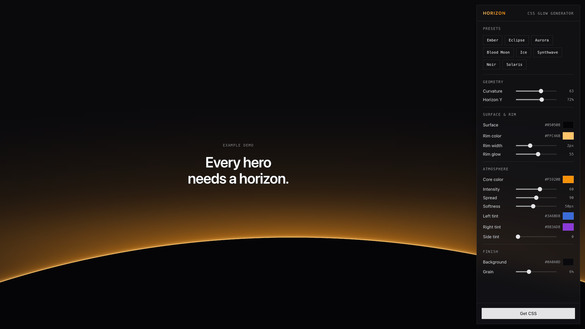

## About

Horizon is a browser-based design tool for creating glowing "horizon" hero backgrounds — the kind of moody, luminous gradient where a bright rim of light sits on a dark plane, like a sun cresting a distant edge. You dial in the look with a floating control panel while the entire page acts as a live, full-screen preview, and when you're happy you hit **Get CSS** and copy the result straight into your own project.

The whole thing is pure CSS. There's no image, no canvas, and no JavaScript in the output — every effect is rendered with `::before` and `::after` pseudo-elements on a single `.horizon` element.

## Why I built it

I kept seeing this exact effect — a dark hero section with a warm glow bleeding up from the horizon — all over design sites and inspiration galleries, but I could never find an actual code example to start from. And under the hood it's the kind of thing that's genuinely irritating to build: it's easy to eyeball but an absolute pain to do by hand, because every knob (glow spread, rim thickness, blur, grain) interacts with the others, and you can't really see what you're doing until it's in the browser.

So instead of fighting with it, I had Claude build the developer tool I wanted: something where the page *is* the preview, every slider updates instantly, and the output is clean, dependency-free CSS I can paste anywhere.

## How it works

The generator is organized around four groups of controls, each mapping to a real layer of the final CSS:

- **Geometry** — a `curvature` slider takes the surface from a flat plane all the way to a tight, moon-like disc, and `horizonY` sets where the horizon line sits vertically.
- **Rim** — the bright line of light along the horizon: its color, width, and glow intensity. This is the signature detail that sells the effect.
- **Atmosphere** — the glow itself. A `core` color, intensity, and spread control the central bloom; separate left/right accent colors and a side-intensity slider let you push cool or complementary light in from the edges; an atmosphere blur softens the whole thing; and surface/background colors set the base.
- **Grain** — a subtle film-grain overlay to break up gradient banding and add texture.

Under the hood, all of this lives in a single `useHorizon` composable that holds the reactive state, ships the presets, and generates the CSS string. The output is three layers: a `::before` for the atmospheric glow (radial gradients plus an optional blur), the `.horizon__surface` for the plane or disc and its glowing rim (`border-top` plus layered `box-shadow`s), and a `::after` that overlays an embedded SVG fractal-noise pattern with `mix-blend-mode: overlay` for the grain.

## Presets

If you'd rather start from a vibe than a blank slate, there are eight presets to jump off from: **Ember**, **Eclipse**, **Aurora**, **Blood Moon**, **Ice**, **Synthwave**, **Noir**, and **Solaris**. Each sets every control at once, and from there you can nudge whatever you want.

## Tech stack

- **Vue 3** (`<script setup>` SFCs) for the UI
- **TypeScript** throughout, with a single `useHorizon` composable for shared state and CSS generation
- **Vite** for dev/build tooling
- **Tailwind CSS 4** for styling
- **shadcn-vue** (built on **reka-ui**) for the sliders, dialog, and other UI primitives
- **Lucide** icons
- **Netlify** for hosting and deploys
- Built with the help of [Claude Code](https://claude.ai/code)
