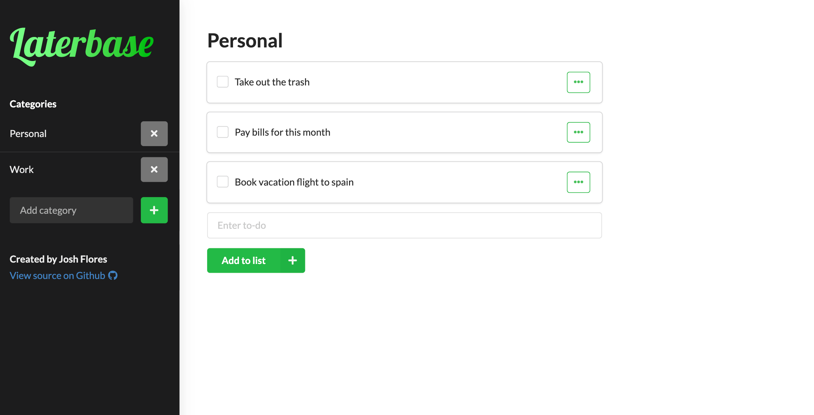

## About

There are many to-do apps out there but this one is mine! It's a fully functional task tracking app that allows you to add tasks, categories, and add notes to each task. Check this one out to see some approaches I use for user interface design.

[Try it out!](https://laterbase.netlify.app/)

## Screenshots

## More

[View on GitHub](https://github.com/Joshua-Flores/todo-app)
