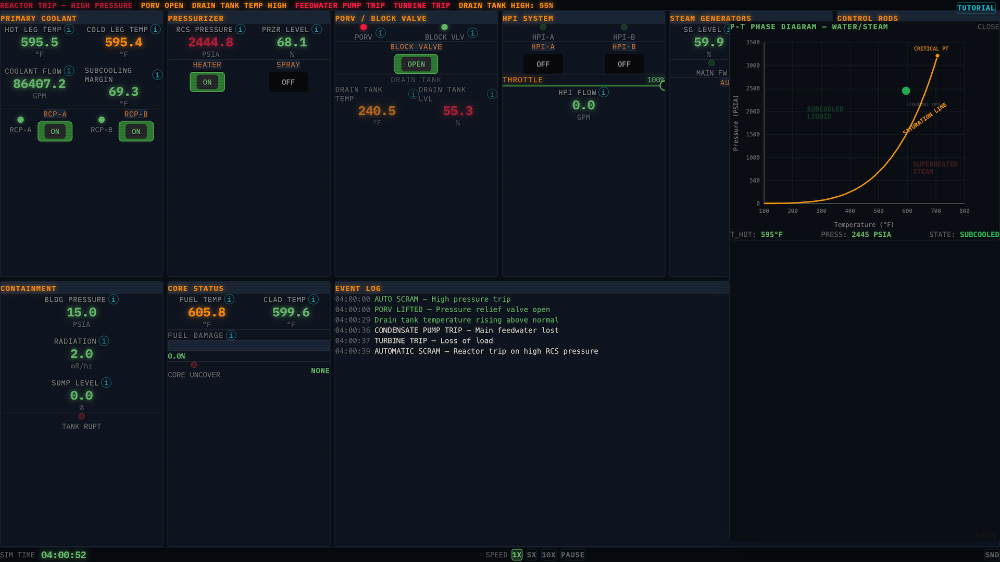

## About

This is a browser-based control-room simulator that puts you in the operator's chair at **04:00 on March 28, 1979** — the moment the Three Mile Island Unit 2 accident began. Feedwater is about to be lost, the reactor is about to trip, and a pilot-operated relief valve (PORV) is about to stick open while its indicator light insists it's closed. Your job is to read the instruments, figure out what's actually happening, and stabilize the plant before the core is destroyed.

It's built to feel like a real pressurized-water-reactor (PWR) control board from the period: banks of gauges, indicator lights, alarm annunciators, and switches — with no tooltips telling you what to do on the hardest setting.

## Why I built it

This started as an experiment: I wanted to see how far I could push [Claude](https://claude.ai) as a tool for building video games. This one was built entirely with Claude — including the entire physics engine, which I couldn't have written myself since I have zero background in nuclear power. I described what I wanted, and Claude generated the reactor model, the accident scenario, and the control-room UI.

The subject matter was personal. I was staying with my parents at the time, and my father is a nuclear engineer who worked in the industry at the time of the Three Mile Island accident — so I thought it would be fun to build something he could actually play. The whole point was to see whether someone with a real background in reactor operations could catch, in real time and from the same instruments, the thing the TMI-2 operators didn't. He beat it on his first try.

## How it works

Under the hood there are three cleanly separated layers wired together by a single game loop:

- **A physics engine** written in pure TypeScript with no Vue dependency, so it can be reasoned about, tested, and reused independently of the interface. Each tick it advances eight interacting subsystems — control rods, fuel core, steam generator, PORV, high-pressure injection, primary loop, pressurizer, and containment — in a deliberate order, feeding the outputs of one into the next.
- **A scenario system** that scripts the accident on top of that engine using a declarative list of timed and conditional `trigger → action` events. Because the whole 1979 sequence is data rather than code, it's easy to read, tweak, or author entirely new scenarios.
- **A Vue/Pinia UI** that renders state and forwards operator commands. The interface never mutates the engine directly — it only sends commands and syncs engine state into the store once per rendered frame.

The physics is a lumped-parameter approximation — realistic in behavior rather than a finite-element core model — but it's intentionally faithful at the extremes, not just the normal operating band. Decay heat follows an ANS 5.1–style curve, the primary loop runs a real coolant energy-balance integration, subcooling margin is computed against a steam-table saturation temperature, and fuel damage accelerates through moderate, severe, and catastrophic bands as the core heats up.

## The central deception

The accident hinges on one detail, and the sim reproduces it exactly: the PORV's indicator light tracks the *commanded* position, not the *actual* valve position. When the scenario jams the valve open, commanding it closed sets the light to "closed" while coolant keeps pouring out — and there's deliberately no alarm for it. Everything on the board looks nominal. The only evidence is indirect: rising drain-tank temperature and level, a climbing containment sump, falling subcooling margin. Recognizing the loss of coolant from those clues and closing the upstream block valve to isolate the stuck valve is the real-world fix, and the winning move here.

## Difficulty and scoring

Three difficulty modes re-tune both the physics and the amount of help — **Visitor** (guided prompts and forgiving physics), **Operator** (subtle gauge highlights and tighter physics), and **Engineer** (no hand-holding, pure instruments, authentic thresholds). The game tracks peak core temperature, peak fuel damage, radiation released, and how long it took you to recognize the stuck PORV, and rolls those into a letter grade at the end. You win by isolating the leak and holding the plant in a stable band through to the end of the shift; you lose if the core is destroyed or the vessel over-pressurizes and ruptures.

## Tech stack

- **Vue 3** (`<script setup>` SFCs) for the UI
- **Pinia** for reactive state stores
- **PrimeVue** + **Tailwind CSS 4** for the control-room components and styling
- **TypeScript** throughout, including a Vue-free simulation engine
- **Vite** for dev/build tooling
- **Netlify** for hosting and deploys
