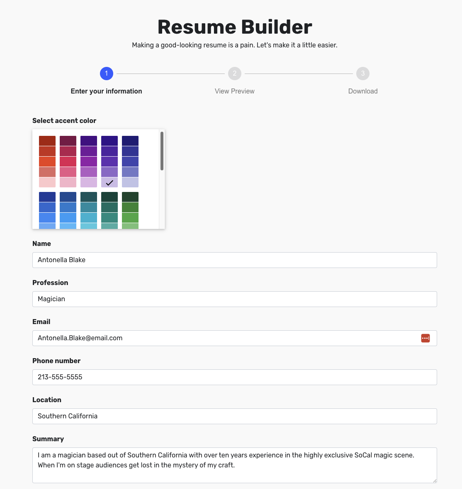

## About

This small web app I worked on that illustrates my approaches to clean and simple form design. A lot of what makes writing a resume difficult is people don't know what to put and don't know how to make it look good - this app will help with both. In addition this project also demonstrates my attention to detail with UI design elements.

[Try it out!](https://jf-resume-builder.netlify.app/)

## Screenshots

## More

[View on GitHub](https://github.com/Joshua-Flores/cv-project)
