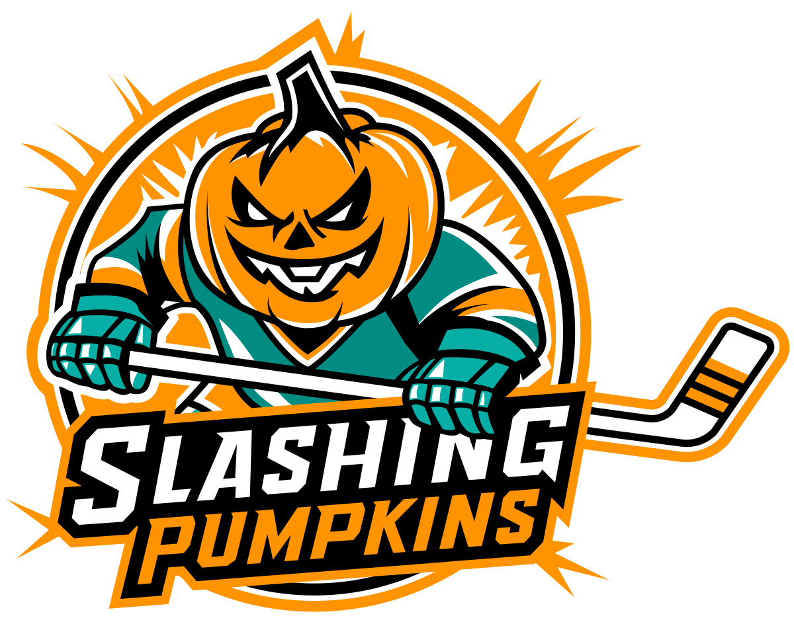

## About

This is the official site for the novice hockey team I play on — the Slashing Pumpkins, based in Fairfax, Virginia. It all started with a logo: one of our players designed the pumpkin mark that became the face of the team, and I took that as the jumping-off point and used my web design skills to build a professional-looking site around it. The result is the team's public-facing hub — a home for the schedule, season record, roster, and a countdown to the next puck drop, with a heavy dose of team branding (orange accents, the pumpkin logo, and a hero video of warmups).

## My first Claude Code project

This was the first site I built almost entirely with [Claude Code](https://claude.ai/code). I started with the general tech stack I wanted and then had Claude handle as much of the nitty-gritty as possible so I could move quickly and keep my attention on styling and content. That workflow let me iterate through design concepts much faster than I could have on my own, tweaking layouts and visual directions until I landed on something I liked.

One area I found Claude particularly helpful with was **animations** — transitions, entrance effects, the countdown ticker, and the photo marquee. Animations can be a pain to do by hand, and being able to describe the feel I wanted and get a working implementation back was a huge accelerator.

A few other things that worked well:

- **A well-written `CLAUDE.md` is a force multiplier.** Spelling out the tech stack (Vue 3 composition API only, PrimeVue over custom components, Tailwind only for styling, `type` over `interface`) meant I rarely had to re-correct stylistic choices between sessions.
- **Static data in TypeScript files** (`src/data/games.ts`, `src/data/roster.ts`) kept the project backend-free and made it trivial for Claude to update the schedule after each game.
- **Small, focused PRs** were much easier to review than large multi-feature changes, especially when I was still building trust in the workflow.

## Tech stack

- **Vue 3** (composition API) + **TypeScript**
- **Vite** for dev server and build
- **Vue Router** for routing between Home, Schedule, and Roster views
- **PrimeVue** + **PrimeIcons** for UI primitives
- **Tailwind CSS 4** for styling
- **Plausible** for privacy-friendly analytics
- **ESLint** + **Prettier** + **Husky** + **lint-staged** for code quality
- **Netlify** for hosting and deploys
- No backend — schedule and roster data live in typed TS files under `src/data/`

## Features

- **Next Puck Drop** — a live countdown to the next scheduled game
- **Season record** — wins/losses/ties rolled up from the games data
- **Upcoming games** — the next three games on the homepage with a link to the full schedule
- **Roster page** — player profiles with jersey numbers and positions
- **Schedule page** — full season schedule with results
- **Mobile-first responsive design** — most visitors are on their phones, so the layout is built for that first
- **Hero video background** of the team warming up on the ice

## Screenshot

[View on GitHub](https://github.com/Joshua-Flores/slashing-pumpkins)
