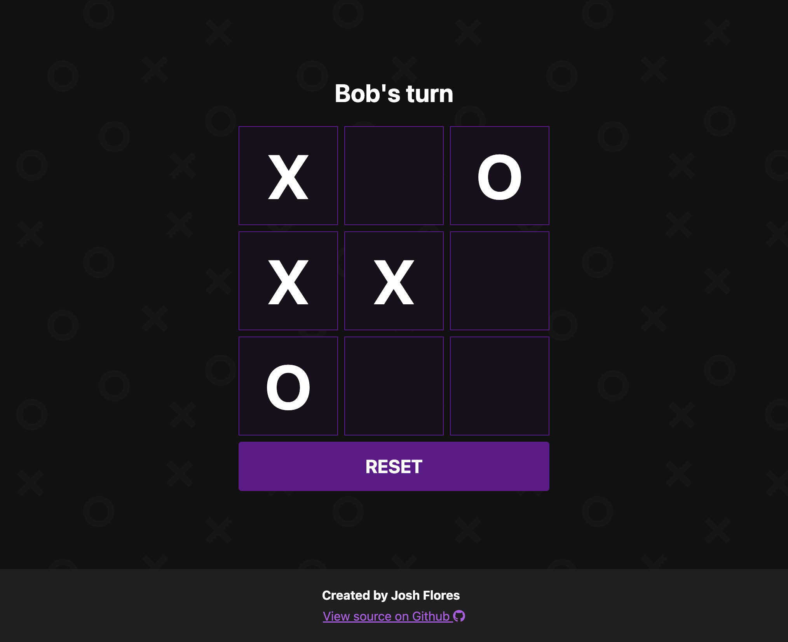

## About

Turn based tic-tac-toe game with the ability to name players. Built as part of a learning exercise while going through The Odin Project. Detects when the game is complete and congratulates the winner.

## Screenshots

